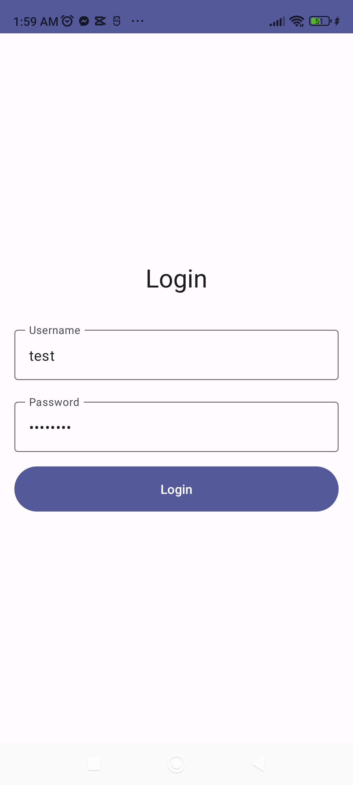

# Modern Android Login App

A modern Android application demonstrating MVVM pattern, and Jetpack Compose implementation of a login system. This project serves as a template and learning resource for building modern Android applications.

 

## Features

- 🎨 Modern UI with Jetpack Compose
- 📐 MVVM Architecture
- 🌗 Dark/Light theme support
- 🔄 State management with Kotlin Flow
- 🧪 Comprehensive test coverage
- 🎯 Material Design 3
- 📱 Responsive design
- 🔒 Simulated authentication flow

## Tech Stack

- **UI Framework**: Jetpack Compose
- **Architecture**: MVVM (Model-View-ViewModel)
- **State Management**: Kotlin Flow
- **Dependency Injection**: Manual DI (can be extended to Hilt)
- **Testing**: JUnit, Turbine, MockK
- **Build System**: Gradle with Kotlin DSL
- **CI/CD**: GitHub Actions

## Prerequisites

- Android Studio Hedgehog | 2023.1.1 or newer
- Minimum SDK: 24
- Target SDK: 34
- Kotlin version: 1.9.20
- Gradle version: 8.1.2

## Getting Started

1. Clone the repository:
```bash
git clone https://github.com/johnearlelevado/login-app.git
```

2. Open the project in Android Studio

3. Build and run the application

4. Use these credentials to test the login:
- Username: `test`
- Password: `password`

## Project Structure

```
app/
├── src/
│   ├── main/
│   │   ├── java/com/example/loginapp/
│   │   │   ├── data/
│   │   │   │   └── UserRepository.kt
│   │   │   ├── models/
│   │   │   │   └── User.kt
│   │   │   ├── ui/
│   │   │   │   ├── login/
│   │   │   │   │   ├── LoginScreen.kt
│   │   │   │   │   ├── LoginViewModel.kt
│   │   │   │   │   └── LoginUiState.kt
│   │   │   │   ├── theme/
│   │   │   │   │   ├── Color.kt
│   │   │   │   │   ├── Theme.kt
│   │   │   │   │   └── Type.kt
│   │   │   │   └── welcome/
│   │   │   │       └── WelcomeScreen.kt
│   │   │   └── MainActivity.kt
│   │   └── res/
│   ├── test/
│   │   └── java/
│   └── androidTest/
│       └── java/
└── build.gradle.kts
```

## Architecture

The application follows the MVVM (Model-View-ViewModel) architecture pattern and clean architecture principles:

- **UI Layer**: Compose UI components
- **ViewModel Layer**: Manages UI state and business logic
- **Data Layer**: Repository pattern for data operations


## Testing

The project includes comprehensive test coverage:

- **Unit Tests**: ViewModels, Repository, and business logic
- **UI Tests**: Compose UI testing
- **Integration Tests**: End-to-end flow testing

Run tests using:
```bash
# Unit tests
./gradlew test

# UI tests
./gradlew connectedCheck
```

## Contributing

1. Fork the repository
2. Create your feature branch (`git checkout -b feature/AmazingFeature`)
3. Commit your changes (`git commit -m 'Add some AmazingFeature'`)
4. Push to the branch (`git push origin feature/AmazingFeature`)
5. Open a Pull Request

## Acknowledgments

- Material Design 3 Guidelines
- Android Jetpack Components
- Kotlin Coroutines and Flow
- JUnit and Mockito testing frameworks

## Contact

Your Name - [@yourtwitter](https://twitter.com/yourtwitter)

Project Link: [https://github.com/johnearlelevado/login-app](https://github.com/yourusername/login-app)
